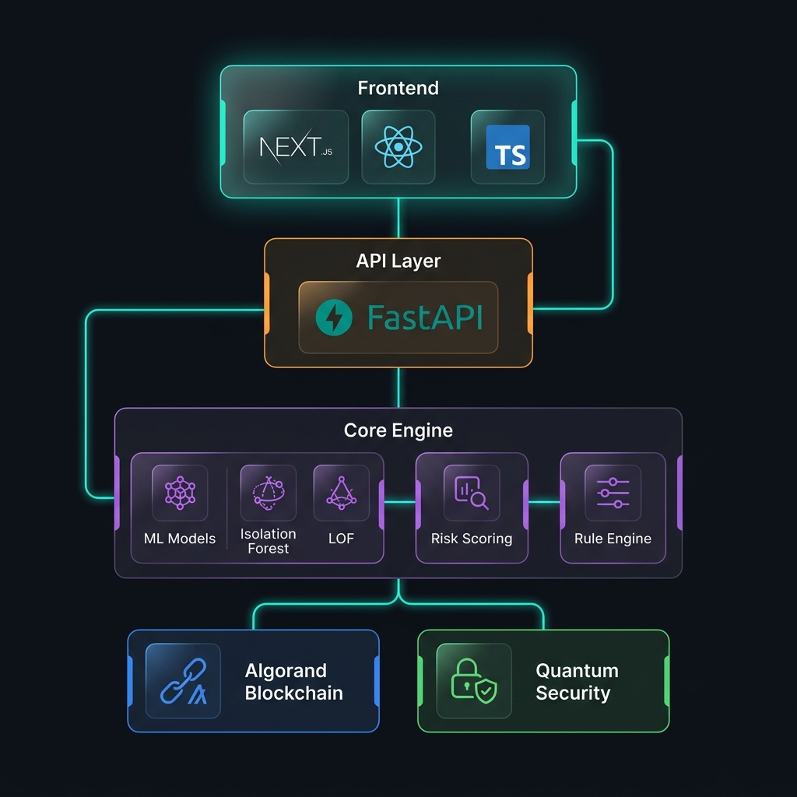

<p align="center">
  
</p>

<p align="center">
  
</p>

<h1 align="center">🛡️ SurakshaNet</h1>

<p align="center">
  <strong>AI-Powered Healthcare Fraud Detection · Blockchain Verified · Quantum Secured</strong>
</p>

<p align="center">
  <em>Safeguarding India's Healthcare Ecosystem with Intelligent Anomaly Detection</em>
</p>

<br/>

<p align="center">
  <a href="#-features"></a>
  <a href="#-blockchain--quantum-security"></a>
  <a href="#-tech-stack"></a>
  <a href="#-tech-stack"></a>
</p>

<p align="center">
  <a href="https://github.com/v3nom-95/SurakshaNet/stargazers"></a>
  <a href="https://github.com/v3nom-95/SurakshaNet/network/members"></a>
  <a href="https://github.com/v3nom-95/SurakshaNet/issues"></a>
  <a href="LICENSE"></a>
  
  
</p>

<br/>

---

<br/>

## 📋 Table of Contents

<details>
<summary>Click to expand</summary>

- [🔍 Overview](#-overview)
- [✨ Features](#-features)
- [🏗️ Architecture](#️-architecture)
- [🔐 Blockchain & Quantum Security](#-blockchain--quantum-security)
- [🛠️ Tech Stack](#️-tech-stack)
- [⚡ Quick Start](#-quick-start)
- [📡 API Reference](#-api-reference)
- [🤖 Web3 AI Agent](#-web3-ai-agent)
- [📊 Fraud Detection Pipeline](#-fraud-detection-pipeline)
- [⚙️ Configuration](#️-configuration)
- [🚀 Deployment](#-deployment)
- [📈 Performance](#-performance)
- [🗺️ Roadmap](#️-roadmap)
- [📄 License](#-license)
- [📬 Contact](#-contact)

</details>

<br/>

---

<br/>

## 🔍 Overview

**SurakshaNet** *(Sanskrit: सुरक्षा = Protection + Net = Network)* is an enterprise-grade fraud detection platform purpose-built for India's **Ayushman Bharat** healthcare scheme. It combines cutting-edge machine learning, immutable blockchain audit trails on **Algorand**, and **quantum-resistant cryptography** to detect, prevent, and report fraudulent claims in real-time.

<br/>

<table>
<tr>
<td width="50%">

### 🎯 The Problem

Healthcare fraud in India costs the system **thousands of crores annually**. Common schemes include:

- 🏥 **Ghost billing** — claims for non-existent treatments
- 💊 **Up-coding** — inflating treatment costs
- 📈 **Claim surges** — abnormal spikes in claim volume
- 🔄 **Duplicate claims** — resubmitting for the same treatment

</td>
<td width="50%">

### 💡 Our Solution

SurakshaNet deploys a **multi-layered defense system**:

- 🧠 **ML Anomaly Detection** — Isolation Forest + LOF models
- 📏 **Rule-Based Flagging** — heuristic pattern matching
- ⛓️ **Blockchain Anchoring** — immutable Algorand audit trails
- 🔮 **Quantum Security** — post-quantum cryptographic seals
- 🤖 **AI Agent** — natural language investigation via LLM

</td>
</tr>
</table>

<br/>

---

<br/>

## ✨ Features

<table>
<tr>
<td align="center" width="25%">
<br/>

<br/><br/>
<strong>Intelligent Detection</strong>
<br/>
Isolation Forest & LOF anomaly detection with multi-factor risk scoring and customizable thresholds
<br/><br/>
</td>
<td align="center" width="25%">
<br/>

<br/><br/>
<strong>Algorand Integration</strong>
<br/>
Immutable claim verification records, tamper-proof audit trails, and transparent accountability
<br/><br/>
</td>
<td align="center" width="25%">
<br/>

<br/><br/>
<strong>Quantum Security</strong>
<br/>
Post-quantum cryptographic seals protecting report integrity against future computing threats
<br/><br/>
</td>
<td align="center" width="25%">
<br/>

<br/><br/>
<strong>Web3 AI Agent</strong>
<br/>
Natural language investigation powered by Llama 3.3 70B via Groq with blockchain anchoring
<br/><br/>
</td>
</tr>
</table>

<table>
<tr>
<td align="center" width="33%">
<br/>

<br/><br/>
<strong>Real-time Dashboard</strong>
<br/>
Glassmorphism UI with interactive Recharts visualizations, KPI cards, and trend analysis
<br/><br/>
</td>
<td align="center" width="33%">
<br/>

<br/><br/>
<strong>High Performance</strong>
<br/>
~100ms claim processing, background scheduling, optimized caching, 30K+ dataset analysis
<br/><br/>
</td>
<td align="center" width="33%">
<br/>

<br/><br/>
<strong>Automated Reports</strong>
<br/>
AI-generated fraud reports with quantum seals, blockchain verification, and audit readiness
<br/><br/>
</td>
</tr>
</table>

<br/>

---

<br/>

## 🏗️ Architecture

<p align="center">
  
</p>

```
┌─────────────────────────────────────────────────────────────────────────┐
│                        🌐  FRONTEND  (Next.js 15+)                      │
│  ┌─────────┐ ┌──────────┐ ┌───────────┐ ┌──────────┐ ┌─────────────┐  │
│  │Dashboard │ │ Claims   │ │ Hospitals │ │ Reports  │ │  AI Agent   │  │
│  │Analytics │ │  Table   │ │   Table   │ │  Viewer  │ │    Chat     │  │
│  └────┬─────┘ └────┬─────┘ └─────┬─────┘ └────┬─────┘ └──────┬──────┘  │
│       └─────────────┴─────────────┴─────────────┴──────────────┘        │
└─────────────────────────────────┬───────────────────────────────────────┘
                                  │ REST API
┌─────────────────────────────────┴───────────────────────────────────────┐
│                      ⚡  API LAYER  (FastAPI)                            │
│  /health  /login  /get-summary  /get-claim-anomalies  /agent/query      │
│  /get-high-risk-hospitals  /get-all-hospitals  /generate-report          │
└───────┬──────────────┬──────────────┬──────────────┬────────────────────┘
        │              │              │              │
   ┌────┴────┐   ┌─────┴─────┐  ┌────┴─────┐  ┌────┴──────┐
   │ ML      │   │  Risk     │  │ Rule     │  │ Report    │
   │ Models  │   │  Scoring  │  │ Engine   │  │ Generator │
   │ IF+LOF  │   │  Engine   │  │ Heurist. │  │ + LLM     │
   └────┬────┘   └─────┬─────┘  └────┬─────┘  └────┬──────┘
        └──────────────┴──────────────┘              │
                       │                             │
        ┌──────────────┴─────────────┐  ┌────────────┴──────────────┐
        │    🗄️  SQLite Database      │  │  ⛓️  Algorand Blockchain   │
        │    Claims · Hospitals      │  │  Audit Trails · Tx Hashes │
        │    Users · Risk Profiles   │  │  Quantum Seals · Reports  │
        └────────────────────────────┘  └───────────────────────────┘
```

<br/>

---

<br/>

## 🔐 Blockchain & Quantum Security

<table>
<tr>
<td width="50%">

### ⛓️ Algorand Blockchain

SurakshaNet anchors every fraud report to the **Algorand TestNet**, creating an immutable and publicly verifiable audit trail.

| Feature | Details |
|---------|---------|
| **Network** | Algorand TestNet |
| **SDK** | `py-algorand-sdk 2.7.0` |
| **Storage** | SHA-256 report hashes in note field |
| **Finality** | < 4 seconds |
| **Verification** | Publicly queryable via AlgoExplorer |

</td>
<td width="50%">

### 🔮 Quantum-Safe Cryptography

Reports are sealed with **post-quantum cryptographic mechanisms**, ensuring long-term data integrity even against future quantum computing threats.

| Feature | Details |
|---------|---------|
| **Seal Type** | Quantum Entropy Token |
| **Algorithm** | Lattice-based cryptographic hash |
| **Purpose** | Tamper-proof report verification |
| **Threat Model** | Post-quantum adversary |
| **Integration** | Automatic on report generation |

</td>
</tr>
</table>

<br/>

---

<br/>

## 🛠️ Tech Stack

<table>
<tr>
<th align="center">Layer</th>
<th align="center">Technology</th>
<th align="center">Purpose</th>
</tr>
<tr>
<td><strong>🌐 Frontend</strong></td>
<td>
  
  
  
</td>
<td>Modern SSR dashboard with glassmorphism UI</td>
</tr>
<tr>
<td><strong>📊 Visualization</strong></td>
<td>
  
  
  
</td>
<td>Interactive charts, animations, and iconography</td>
</tr>
<tr>
<td><strong>⚡ Backend</strong></td>
<td>
  
  
  
</td>
<td>High-performance async API with data validation</td>
</tr>
<tr>
<td><strong>🧠 ML/AI</strong></td>
<td>
  
  
  
</td>
<td>Isolation Forest, LOF anomaly detection, feature engineering</td>
</tr>
<tr>
<td><strong>🤖 AI Agent</strong></td>
<td>
  
  
  
</td>
<td>Natural language fraud investigation & blockchain anchoring</td>
</tr>
<tr>
<td><strong>⛓️ Blockchain</strong></td>
<td>
  
</td>
<td>Immutable audit trails with < 4s finality</td>
</tr>
<tr>
<td><strong>🗄️ Database</strong></td>
<td>
  
</td>
<td>Lightweight persistence with expandable schema</td>
</tr>
<tr>
<td><strong>☁️ Deployment</strong></td>
<td>
  
</td>
<td>Production deployment with auto-scaling</td>
</tr>
</table>

<br/>

---

<br/>

## ⚡ Quick Start

### Prerequisites

| Requirement | Version | Notes |
|-------------|---------|-------|
| **Python** | 3.9+ | Recommended: 3.11 |
| **Node.js** | 18+ | Recommended: 20 LTS |
| **Git** | Latest | — |
| **Algorand Wallet** | — | TestNet mnemonic (optional) |
| **Groq API Key** | — | Free tier at [console.groq.com](https://console.groq.com/) |

### 1️⃣ Clone & Configure

```bash
# Clone the repository
git clone https://github.com/v3nom-95/SurakshaNet.git
cd SurakshaNet

# Set up environment variables
cp .env.example .env
# Edit .env with your API keys
```

### 2️⃣ Backend Setup

```bash
# Create and activate virtual environment
python -m venv venv

# Windows
venv\Scripts\activate

# macOS / Linux
source venv/bin/activate

# Install dependencies
pip install -r requirements.txt
```

### 3️⃣ Start the Backend

```bash
python -m fraud_detection_agent.main

# ✅ API available at:       http://localhost:8000
# 📖 Swagger docs at:        http://localhost:8000/docs
# 📊 Auto-generates 30K claim dataset on first run
```

### 4️⃣ Frontend Setup

```bash
cd frontend

# Install dependencies
npm install

# Start development server
npm run dev

# ✅ Dashboard available at:  http://localhost:3000
```

<br/>

---

<br/>

## 📡 API Reference

<details>
<summary><strong>🔵 Core Endpoints</strong> — Click to expand</summary>
<br/>

| Method | Endpoint | Description |
|--------|----------|-------------|
| `GET` | `/health` | System health check |
| `POST` | `/login` | User authentication |
| `GET` | `/get-summary` | Dashboard summary stats, trends, and distributions |
| `GET` | `/get-claim-anomalies` | Suspicious claims with anomaly scores |
| `GET` | `/get-high-risk-hospitals` | Top hospitals ranked by risk score |
| `GET` | `/get-all-hospitals` | Complete hospital directory with risk profiles |
| `GET` | `/get-claims-search` | Search claims by ID or patient ID |
| `GET` | `/generate-report` | Generate fraud report + blockchain anchor |
| `GET` | `/get-monitoring-trends` | Historical monitoring snapshots |

</details>

<details>
<summary><strong>🤖 Web3 AI Agent Endpoints</strong> — Click to expand</summary>
<br/>

| Method | Endpoint | Description |
|--------|----------|-------------|
| `POST` | `/agent/query` | Natural language fraud investigation query |
| `GET` | `/agent/status` | Agent availability and capabilities check |

#### Example Agent Queries

```json
{
  "query": "Run the fraud pipeline and tell me the top 5 risky hospitals in Maharashtra"
}
```

```json
{
  "query": "Explain why claim CLM_0000042 is suspicious"
}
```

```json
{
  "query": "Generate a full audit report for Delhi and anchor it to the blockchain"
}
```

</details>

<details>
<summary><strong>🔍 Query Parameters</strong> — Click to expand</summary>
<br/>

Most endpoints support these optional filters:

| Parameter | Type | Default | Description |
|-----------|------|---------|-------------|
| `state` | `string` | `"All"` | Filter by Indian state |
| `district` | `string` | `"All"` | Filter by district |
| `hospital_type` | `string` | `null` | Filter by hospital type |
| `limit` | `int` | Varies | Max results to return |

</details>

<br/>

---

<br/>

## 🤖 Web3 AI Agent

SurakshaNet features an integrated **Web3 AI Agent** powered by **Llama 3.3 70B** (via Groq's free tier) and **LangChain**. The agent provides a natural language interface for fraud investigation and blockchain operations.

<table>
<tr>
<td width="50%">

### 🧠 Capabilities

- **Fraud Pipeline Analysis** — Run and interpret ML detection results
- **Hospital Risk Profiling** — Investigate specific hospitals
- **Claim Investigation** — Deep-dive into why a claim is flagged
- **Report Generation** — Create comprehensive audit reports
- **Blockchain Anchoring** — Anchor reports to Algorand immutably

</td>
<td width="50%">

### 🔧 Requirements

| Component | Details |
|-----------|---------|
| **LLM Provider** | Groq (free tier) |
| **Model** | `llama-3.3-70b-versatile` |
| **Rate Limit** | 14,400 requests/day |
| **Cost** | 💸 **Free** — no credit card needed |
| **Blockchain** | Algorand TestNet (optional) |

> Get your free API key at [console.groq.com](https://console.groq.com/)

</td>
</tr>
</table>

<br/>

---

<br/>

## 📊 Fraud Detection Pipeline

```
📥 Data Ingestion          ⟶  30,000+ synthetic healthcare claims
       │
       ▼
🧹 Preprocessing           ⟶  Feature normalization, scaling, engineering
       │
       ▼
🧠 Anomaly Detection        ⟶  Isolation Forest + Local Outlier Factor (LOF)
       │
       ▼
📏 Rule-Based Flagging      ⟶  Up-coding · Ghost Billing · Claim Surge detection
       │
       ▼
📊 Risk Scoring             ⟶  Multi-dimensional risk assessment (0.0 → 1.0)
       │
       ▼
🏥 Hospital Aggregation     ⟶  Facility-level risk profiles (Low / Medium / High)
       │
       ▼
⛓️ Blockchain Anchoring     ⟶  SHA-256 hash → Algorand TestNet transaction
       │
       ▼
🔮 Quantum Sealing          ⟶  Post-quantum cryptographic tamper protection
       │
       ▼
📋 Report Generation        ⟶  AI-generated audit-ready fraud reports
```

### Detection Methods

| Method | Type | Detects |
|--------|------|---------|
| **Isolation Forest** | ML (Unsupervised) | Unusual claim amounts, frequencies, and temporal patterns |
| **Local Outlier Factor** | ML (Unsupervised) | Local density anomalies in claim neighborhoods |
| **Up-coding Rules** | Heuristic | Inflated procedure costs relative to diagnosis codes |
| **Ghost Billing Rules** | Heuristic | Claims for non-existent or implausible treatments |
| **Claim Surge Rules** | Heuristic | Abnormal spikes in claim volume per facility |

<br/>

---

<br/>

## ⚙️ Configuration

### Environment Variables

```env
# ─── Required ─────────────────────────────────────────
GROQ_API_KEY=your_groq_api_key_here          # Free at https://console.groq.com/
ALGORAND_MNEMONIC=word1 word2 ... word25      # Algorand TestNet wallet

# ─── ML Tuning (Optional) ────────────────────────────
CONTAMINATION_RATE=0.10                       # Expected fraud rate (default: 10%)
ANOMALY_THRESHOLD=0.70                        # Anomaly score cutoff (default: 0.70)
DATASET_SIZE=30000                            # Synthetic dataset size

# ─── CORS (Optional) ─────────────────────────────────
ALLOWED_ORIGINS=*                             # Set to frontend URL in production
```

### Customization Points

| Component | File | What to Modify |
|-----------|------|----------------|
| **ML Models** | `fraud_detection_agent/models/anomaly_model.py` | Detection algorithms, contamination rate |
| **Risk Scoring** | `fraud_detection_agent/scoring/risk_scoring.py` | Score weights, thresholds, categories |
| **Rule Engine** | `fraud_detection_agent/scoring/risk_scoring.py` | Heuristic rules, fraud pattern definitions |
| **Database** | `fraud_detection_agent/database/db_setup.py` | Schema, mock data generation |
| **API Routes** | `fraud_detection_agent/main.py` | Endpoints, middleware, business logic |
| **UI Components** | `frontend/src/components/` | Dashboard, charts, tables, AI chat |

<br/>

---

<br/>

## 🚀 Deployment

SurakshaNet includes a pre-configured `render.yaml` for one-click deployment to **Render**.

<details>
<summary><strong>Deploy to Render</strong> — Click to expand</summary>
<br/>

1. Fork this repository
2. Create a new **Blueprint** on [Render](https://render.com)
3. Connect your GitHub repo
4. Set environment variables in the Render dashboard:
   - `ALGORAND_MNEMONIC` — Your Algorand TestNet wallet mnemonic
   - `GROQ_API_KEY` — Your Groq API key
5. Deploy! 🚀

The `render.yaml` automatically configures:
- **Backend**: Python web service with SQLite persistent disk
- **Frontend**: Node.js web service with production build

| Service | URL |
|---------|-----|
| Backend API | `https://surakshanet-backend.onrender.com` |
| Frontend | `https://surakshanet-frontend.onrender.com` |

</details>

<br/>

---

<br/>

## 📈 Performance

| Metric | Value | Notes |
|--------|-------|-------|
| **Claim Processing** | ~100ms per claim | With pipeline caching enabled |
| **Dataset Scale** | 30,000+ claims | Configurable via `DATASET_SIZE` |
| **Dashboard Load** | < 2 seconds | Full analytics view with charts |
| **Blockchain Finality** | < 4 seconds | Algorand TestNet transaction |
| **API Response** | < 500ms | Cached pipeline results |
| **Background Refresh** | Every 1 hour | Automated snapshot scheduler |

<br/>

---

<br/>

## 🗺️ Roadmap

| Status | Feature | Description |
|--------|---------|-------------|
| ✅ | ML Anomaly Detection | Isolation Forest + LOF |
| ✅ | Algorand Blockchain | Immutable audit trails |
| ✅ | Quantum-Safe Seals | Post-quantum report protection |
| ✅ | Web3 AI Agent | LangChain + Llama 3.3 70B |
| ✅ | Glassmorphism Dashboard | Next.js 15 + Recharts |
| ✅ | Render Deployment | One-click cloud deployment |
| 🔲 | Multi-chain Integration | Polygon, Cosmos support |
| 🔲 | Advanced NLP | Claim text analysis |
| 🔲 | Federated Learning | Collaborative detection across hospitals |
| 🔲 | GraphQL API | Enhanced query flexibility |
| 🔲 | Mobile App | On-field verification |
| 🔲 | Kubernetes Config | Container orchestration |

<br/>

---

<br/>

## 📂 Project Structure

```
SurakshaNet/
│
├── 📁 fraud_detection_agent/          # Core backend system
│   ├── 📁 agent/
│   │   ├── monitor.py                 # Real-time claim monitoring & snapshots
│   │   └── web3_agent.py              # LangChain Web3 AI agent (Groq/Llama)
│   ├── 📁 blockchain/
│   │   ├── algorand_client.py         # Algorand SDK integration
│   │   └── quantum_client.py          # Quantum-safe cryptographic seals
│   ├── 📁 database/
│   │   └── db_setup.py                # SQLite init, schema, mock data
│   ├── 📁 models/
│   │   └── anomaly_model.py           # Isolation Forest + LOF models
│   ├── 📁 preprocessing/
│   │   └── preprocess.py              # Feature engineering & normalization
│   ├── 📁 reports/
│   │   └── report_generator.py        # AI-driven fraud report generation
│   ├── 📁 scoring/
│   │   └── risk_scoring.py            # Multi-factor risk assessment
│   ├── config.py                      # Environment configuration
│   └── main.py                        # FastAPI app & route orchestration
│
├── 📁 frontend/                       # Next.js 15+ dashboard
│   ├── 📁 src/
│   │   ├── 📁 app/                    # App router pages & styles
│   │   └── 📁 components/
│   │       ├── AgentChat.tsx           # Web3 AI agent chat interface
│   │       ├── ClaimsTable.tsx         # Searchable claims data table
│   │       ├── Dashboard.tsx           # Analytics dashboard with charts
│   │       ├── HospitalsTable.tsx      # Hospital risk directory
│   │       ├── LoginForm.tsx           # Authentication form
│   │       ├── ReportView.tsx          # Blockchain-verified report viewer
│   │       └── Sidebar.tsx             # Navigation sidebar
│   └── package.json                   # Node.js dependencies
│
├── 📁 assets/                         # README images and branding
├── .env.example                       # Environment variable template
├── render.yaml                        # Render deployment blueprint
├── requirements.txt                   # Python dependencies
├── LICENSE                            # MIT License
└── README.md                          # You are here! 📍
```

<br/>

---

<br/>

## 📄 License

This project is licensed under the **MIT License** — see the [LICENSE](LICENSE) file for details.

```
MIT License · Copyright (c) 2026 v3nom-95
```

<br/>

---

<br/>

## 📬 Contact

<p align="center">
  <strong>Built & Maintained by</strong>
</p>

<p align="center">
  <a href="https://github.com/v3nom-95">
    
  </a>
  &nbsp;
  <a href="mailto:goslingstark95@gmail.com">
    
  </a>
</p>

<br/>

---

<p align="center">
  <sub>⭐ If you found SurakshaNet useful, consider giving it a star — it helps!</sub>
</p>

<p align="center">
  <a href="https://github.com/v3nom-95/SurakshaNet/stargazers">
    
  </a>
</p>
